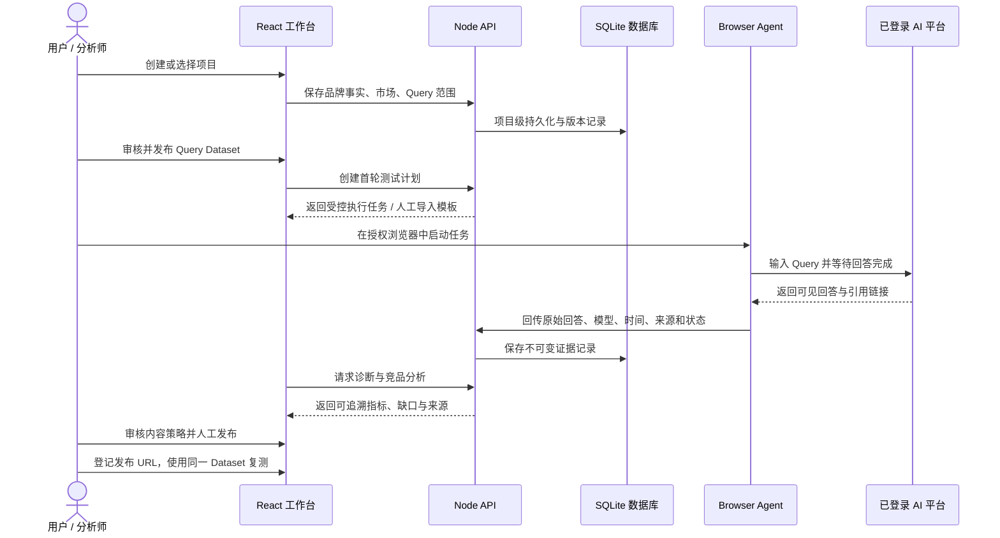
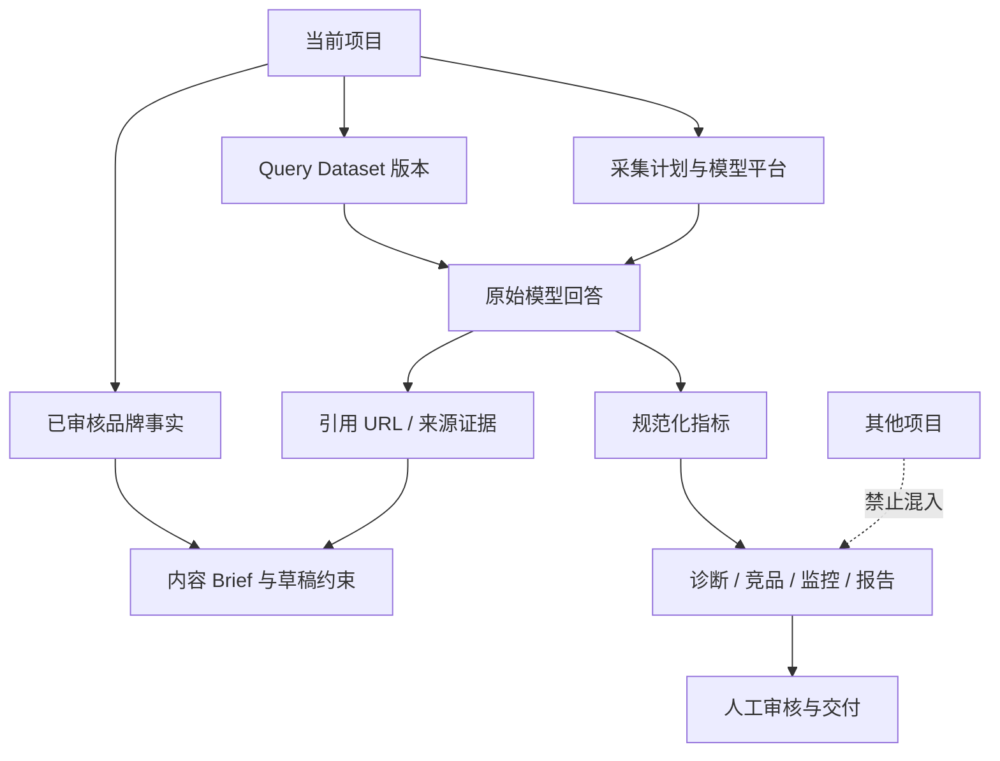

# GEO Compass

> 面向企业团队的证据驱动 GEO（Generative Engine Optimization）工作台：用可审核的 Query、真实 AI 平台回答、引用链接与竞品证据，建立从「基线诊断」到「内容行动、人工发布、持续监控和报告交付」的闭环。


## 项目简介

传统 SEO 关注搜索引擎结果页；GEO 关注用户向豆包、文心一言、通义千问、GLM、Kimi 等 AI 平台提问时，品牌是否被提及、是否被正确描述、是否被推荐，以及哪些来源正在影响模型回答。

GEO Compass 将这些工作组织成一个项目级工作台：

- 用项目与产品档案定义品牌事实、市场、用户和目标；
- 用可审核的 Query Dataset 固化验证问题；
- 通过受控的 Browser Agent 或人工导入获取真实回答和引用证据；
- 按同一 Query 对比竞品、来源链接和文章结构；
- 把问题缺口转成内容策略和待审核草稿；
- 由人手动发布到对应渠道；
- 使用同一版 Query 进行持续监控和发布后复测；
- 在报告中心查看带数据范围、状态和证据边界的交付记录。

> **当前定位：** 高完成度的企业级 MVP / 可运行产品原型。核心工作流、项目隔离、Browser Agent 接口、人工受控路径和前端交互已经实现；部分持续监控与报告数字仍使用前端示意数据，后续接入真实统计服务。

## 核心流程

### 业务闭环

```mermaid
flowchart LR
    A[项目与产品档案] --> B[Query 研究与审核]
    B --> C[Dataset v1 发布]
    C --> D[真实平台测试]
    D --> E[回答与引用证据]
    E --> F[GEO 诊断与基线]
    F --> G[Query 竞品与引用研究]
    G --> H[内容策略与智能写作]
    H --> I[知识资产与发布准备]
    I --> J[人工发布到渠道]
    J --> K[持续监控与发布后复测]
    K --> L[报告中心交付]
    L -.复用同一 Dataset.-> K
```



### 系统全链路 ASCII 架构图

下面这张图用一条主链路说明 GEO Compass 如何把「项目定义、Query、真实模型测试、证据、分析、内容行动和复测」串成可追溯闭环；其中实线代表数据流，虚线代表治理边界或反馈关系。

```text
                                      ┌─────────────────────────────┐
                                      │        GEO COMPASS MVP       │
                                      │  Evidence-driven GEO Workspace│
                                      └──────────────┬──────────────┘
                                                     │
             ┌───────────────────────────────────────┼───────────────────────────────────────┐
             │                                       │                                       │
             ▼                                       ▼                                       ▼
┌──────────────────────┐                 ┌──────────────────────┐                 ┌──────────────────────┐
│  01 项目与产品档案   │                 │  02 Query 研究中心   │                 │  03 模型连接与授权   │
│ 品牌事实 / 市场      │                 │ 生成 / 分类 / 去重    │                 │ 豆包 / 文心 / 千问    │
│ 产品类别 / 用户      │                 │ 审核 / 版本 / 发布    │                 │ GLM / Kimi / 其他平台 │
└──────────┬───────────┘                 └──────────┬───────────┘                 └──────────┬───────────┘
           │                                        │                                        │
           └──────────────────────────────┬─────────┴────────────────────────────────────────┘
                                          ▼
                           ┌─────────────────────────────────┐
                           │       Query Dataset v1           │
                           │ 当前项目边界内的可复测问题集合  │
                           └────────────────┬────────────────┘
                                            │
                                            ▼
                  ┌──────────────────────────────────────────────────────┐
                  │              04 真实平台测试 / Browser Agent          │
                  │  已登录授权浏览器 → 输入 Query → 等待回答完成          │
                  │        ┌───────────────┬───────────────┐             │
                  │        ▼               ▼               ▼             │
                  │     回答文本        引用链接        平台 / 时间 / 状态 │
                  └────────┬───────────────┬───────────────┬─────────────┘
                           │               │               │
                           └───────────────┴───────┬───────┘
                                                   ▼
                           ┌─────────────────────────────────┐
                           │       05 Evidence Store          │
                           │ 原始回答 · 引用 URL · 采集时间    │
                           │ 平台信息 · Query 版本 · 证据状态   │
                           └───────────────┬─────────────────┘
                                           │
             ┌─────────────────────────────┼─────────────────────────────┐
             │                             │                             │
             ▼                             ▼                             ▼
┌────────────────────────┐   ┌────────────────────────┐   ┌────────────────────────┐
│ 06 GEO 诊断与可见度基线 │   │ 07 Query 竞品与引用研究 │   │ 08 内容策略与智能写作  │
│ 提及 / 推荐 / 位置      │   │ 同 Query 横向对比      │   │ 缺口 → Brief → 草稿      │
│ 品牌认知 / 问题缺口     │   │ 竞品 / 链接 / 结构      │   │ 证据约束 / Prompt 版本   │
└───────────┬────────────┘   └───────────┬────────────┘   └───────────┬────────────┘
            │                            │                            │
            └────────────────────────────┴──────────────┬─────────────┘
                                                         ▼
                           ┌─────────────────────────────────┐
                           │      09 知识资产与发布准备        │
                           │ 按渠道整理内容 · 打开创作中心入口  │
                           │ 人工审核 · 人工投放 · 登记发布 URL │
                           └────────────────┬────────────────┘
                                            │
                                            ▼
                           ┌─────────────────────────────────┐
                           │       10 发布后复测 / 持续监控      │
                           │ 核心指标 · 趋势 · 异常 · Query 明细 │
                           │ 平台分布 · 引用来源变化             │
                           └────────────────┬────────────────┘
                                            │
                                            ▼
                           ┌─────────────────────────────────┐
                           │           11 报告中心              │
                           │ 基线摘要 · 变化解释 · 证据链接       │
                           │ 可交付结论 · 后续行动               │
                           └────────────────┬────────────────┘
                                            │
                                            └───────────────┐
                                                            │ 反馈到同一项目 / 同一 Dataset
                                                            ▼
                           ┌─────────────────────────────────┐
                           │       下一轮验证与版本迭代          │
                           │ Query v2 / Prompt vN / 新证据       │
                           └─────────────────────────────────┘

治理边界：
  ┌──────────────────────────────────────────────────────────────────────────────┐
  │ 项目 A 的品牌事实、Query、回答、引用、报告只在项目 A 内流转；禁止跨项目混入。 │
  │ Browser Agent 只使用已授权、已登录的浏览器，不绕过 CAPTCHA 或访问控制。       │
  │ 内容只由用户手动发布，系统不自动投放；示意数据不会冒充真实客户结果。           │
  └──────────────────────────────────────────────────────────────────────────────┘
```
### 一次基线诊断的详细流程



### 数据与证据边界



## 功能模块

| 模块 | 作用 | 当前状态 |
| --- | --- | --- |
| 项目与产品档案 | 设置品牌事实、市场、语种、目标用户和项目边界 | 已实现 |
| Query 研究 | 生成、分类、去重、审核和发布 Query Dataset | 已实现 |
| 真实平台测试 | 配置平台、创建测试计划、人工导入或 Browser Agent 执行 | 已实现核心流程 |
| Browser Agent | 在已登录、授权的浏览器中执行 Query，获取回答与引用 | 已实现接口与平台适配测试 |
| GEO 诊断与基线 | 计算提及、引用、推荐位置和缺口 | 已实现 |
| 竞品与引用研究 | 对同一 Query 的不同回答、链接和竞品进行分析 | 已实现前端工作流 |
| 内容策略与智能写作 | 基于证据生成 Brief、Markdown 草稿和审核状态 | 已实现 |
| 知识资产与发布准备 | 管理发布前材料，按渠道打开人工创作中心 | 已实现前端流程 |
| 持续监控 | 查看指标、趋势、异常、Query 明细和来源变化 | 已实现前端原型，部分数据待后端接入 |
| 报告中心 | 查看基线、竞品、监控和复测报告的交付记录 | 已实现前端原型，部分数据待后端接入 |
| 模型连接与治理 | 配置内部模型 API、受控导入、审计和执行边界 | 已实现核心页面 |

## Agent 在哪里

整个项目不是“所有功能都由 Agent 完成”。Agent 的核心边界是浏览器采集：

1. **Browser Agent 执行层**：操作已授权、已登录的第三方 AI 平台页面；
2. **平台适配层**：处理不同平台的输入框、Shadow DOM、发送按钮、异步生成状态和回答容器；
3. **证据提取层**：提取原始回答、引用链接、模型标识、采集时间和任务状态；
4. **可靠性层**：等待回答完成、避免未完成时发送下一问、失败重试，并在无法确认时 fail closed；
5. **LLM 辅助层**：Query 候选、竞品归纳、内容 Brief 和草稿生成属于模型辅助能力，不等同于浏览器 Agent。

系统不会自动登录、绕过验证码、规避平台限制或自动发布内容。没有授权连接时，使用受控人工导入路径。

## 技术栈

- **前端：** React 19、TypeScript、Vite、Lucide React
- **样式：** CSS，统一的 GEO Compass 设计令牌和响应式布局
- **后端：** Node.js、原生 HTTP 服务、SQLite
- **数据：** 项目、事实、Query Dataset、采集计划、观察结果、引用和审计记录
- **采集：** Browser Agent / 受控人工批量导入
- **测试：** Vitest、React Testing Library、Node API 测试

## 本地运行

### 环境要求

- Node.js **24.x**（项目使用 `node:sqlite`；`package.json` 约束为 `>=24 <25`）
- npm
- Windows PowerShell、macOS 或 Linux shell

### 安装与数据库初始化

```bash
npm ci
npm run migrate
```

默认数据库路径为 `data/geo-harness.sqlite`。可通过环境变量覆盖：

```bash
GEO_DATA_DIR=./data
GEO_DB_PATH=./data/geo-harness.sqlite
PORT=8787
```

不要提交真实客户数据、访问令牌、API Key 或原始敏感回答。

### 启动开发环境

终端一：启动 API：

```bash
npm run api
```

终端二：启动前端：

```bash
npm run dev
```

默认地址：

- 前端：`http://127.0.0.1:5173`
- API：`http://127.0.0.1:8787`
- 健康检查：`http://127.0.0.1:8787/health`

Windows PowerShell 健康检查：

```powershell
Invoke-RestMethod http://127.0.0.1:8787/health
```

### 验证命令

```bash
npm run test:server
npm test -- --run
npm run build
```

完整验证：

```bash
npm run verify
```

当前已验证：前端构建通过，前端测试 **117 项通过**。建议使用 Node.js 24.x 运行完整验证，避免使用旧 Node 版本带来的 Vite / `node:sqlite` 环境差异。

## GitHub Pages 静态演示

仓库已配置 GitHub Actions：每次推送到 `main` 分支后，工作流会自动使用 Node.js 24 构建 `dist/`，并发布到 GitHub Pages。

仓库地址：`https://github.com/zhangjianxin477/Super_GEO`

首次启用时，在 GitHub 仓库中打开：

```text
Settings → Pages → Build and deployment → Source: GitHub Actions
```

随后等待 `Deploy frontend to GitHub Pages` 工作流完成，访问地址通常为：

```text
https://zhangjianxin477.github.io/Super_GEO/
```

也可以在仓库的 `Settings → Pages` 页面直接复制 GitHub 显示的最终地址。Vite 已针对仓库子路径配置 `base: /Super_GEO/`，导航使用 hash 路由，因此刷新 `#reports`、`#monitoring` 等页面不会因为 GitHub Pages 没有后端路由而 404。

### GitHub Pages 的能力边界

GitHub Pages 只托管静态前端，不运行 Node.js API、SQLite 数据库或 Browser Agent。因此在线页面适合用于：

- 面试作品集和产品原型展示；
- 查看首页、工作流结构、交互和响应式 UI；
- 展示不依赖后端的前端页面状态。

完整业务闭环仍需要本地 API：项目数据、模型连接、真实平台测试、回答与引用导入、竞品分析、内容保存和报告数据都依赖 `server/index.mjs`。在 GitHub Pages 中点击需要 API 的工作台入口时，页面可能提示无法连接本地 API，这是静态部署的预期限制，并不代表本地版本不可用。

如果需要让在线地址也具备完整后端能力，需要另行部署 Node.js API 和持久化数据库，并通过 `VITE_API_BASE_URL` 指向 API；这与 GitHub Pages 静态托管是两套部署单元。
## 演示路径

推荐按下面的顺序展示：

```text
登录 / 演示账号
  → 项目与产品档案
  → Query 研究与审核
  → 首轮真实平台测试
  → GEO 诊断与基线
  → Query 竞品与引用研究
  → 内容策略与智能写作
  → 知识资产与人工发布准备
  → 持续监控
  → 报告中心
```

演示时建议重点说明：

- 真实平台采集与 API 辅助分析是两条不同路径；
- 竞品分析基于同一 Query 的真实回答和引用链接；
- 内容不会自动发布，用户点击渠道入口后人工投放；
- 报告、监控和复测复用项目边界与 Dataset 版本；
- 页面上的前端示意数字不会被当作真实客户结果。

## 项目结构

```text
.
├── src/
│   ├── App.tsx                    # 工作台路由、导航和核心页面
│   ├── BrandDiagnostics.tsx       # 项目与产品档案 / 品牌诊断
│   ├── BaselineWorkspace.tsx      # Query 与真实测试工作区
│   ├── VisibilityBaseline.tsx     # GEO 基线和证据视图
│   ├── CompetitorIntelligence.tsx # 竞品与引用研究
│   ├── ContentStudio.tsx          # 内容策略与智能写作
│   ├── AssetsWorkspace.tsx        # 知识资产和人工发布准备
│   ├── ModelConnections.tsx       # 模型连接与配置
│   ├── api.ts                     # 前端 API 客户端与领域类型
│   ├── visibilityMetrics.ts       # 可见度指标计算
│   └── styles.css                 # 统一视觉系统和响应式样式
├── browser-agent/                 # Browser Agent 适配、平台页面操作与测试
├── server/
│   ├── application.mjs            # Node API、领域路由、认证和治理边界
│   ├── database.mjs               # SQLite 初始化与数据库访问
│   └── migrate.mjs                 # 数据库迁移
├── tests/                         # 前端、API、模型适配和领域测试
├── docs/                          # 运行手册、工作流和架构说明
├── index.html
├── package.json
└── vite.config.ts
```

## 安全与产品边界

- 只在已授权、已登录的浏览器环境中执行真实网页采集；
- 不绕过 CAPTCHA、访问控制或平台限制；
- 不把模型 API 输出冒充为真实网页可见度基线；
- API Key 不写入前端源码、报告或导出文件；
- 不自动发布内容、不自动外发报告；
- 没有真实证据时不展示“已完成”的客户指标；
- 所有 Query、回答、引用和报告按当前项目隔离。

## 当前未完成 / 后续计划

1. 将持续监控和报告中心的示意数据替换为真实读模型；
2. 完善 Browser Agent 的跨平台执行队列、幂等、限流和任务恢复；
3. 增加生产级认证、权限、密钥管理和多租户部署；
4. 增加真实报告导出（PDF / CSV）与审计下载记录；
5. 将完整 Node.js API、SQLite 持久化、生产日志和可观测性部署到独立后端；
6. 对竞品结构分析、引用归因和内容建议增加可评估的离线数据集。

## License

当前为个人作品 / 面试展示项目。正式开源前请补充许可证、第三方依赖声明和部署安全说明。


